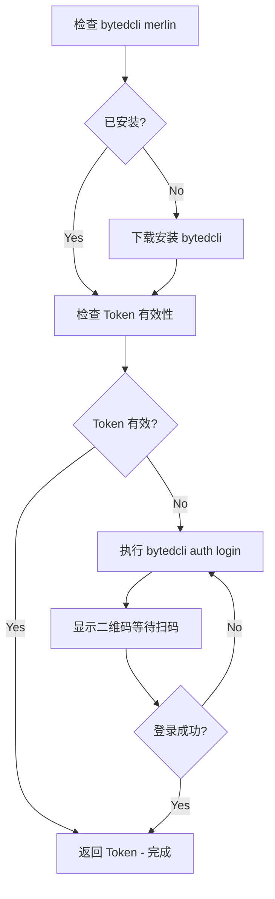

# bytedcli Merlin

## 摘要

bytedcli Merlin 是一个命令行工具，用于调用 Merlin MCP Server 提供的各种 API。工具按领域自动分组（job, devbox, eval, insight, ...），使用 schema-derived CLI options；object/array 字段传 JSON-valued option。

**兜底角色**：本 skill 是 Merlin 相关 skills 的兜底。若用户需求未命中 merlin-job-launch、merlin-devbox、merlin-eval-query、merlin-insight 等更具体的 skill，或用户明确问「bytedcli merlin 有什么命令」「怎么用命令行做 X」，应优先通过本 skill 查找并执行 bytedcli merlin（`merlin --help`、`merlin <group> --help`、`--schema`、schema-derived options）。

## 适用场景

- 用户问「bytedcli merlin 有哪些命令」「怎么用 bytedcli merlin 做 X」且无其它 skill 覆盖
- 当 MCP 工具不可用时，作为替代方案
- 调试和测试 MCP 工具
- 批量操作
- Agent 自动化调用（需要结构化输出时加全局 `--json`，业务入参仍用 schema-derived options）

## 安装

```bash
NPM_CONFIG_REGISTRY=http://bnpm.byted.org npx -y @bytedance-dev/bytedcli@latest merlin --help
```

## Agent 推荐工作流

1. **发现工具**：`bytedcli merlin --help` 或 `bytedcli merlin <group> --help`
2. **查看 Schema**：`bytedcli merlin <group> <command> --schema`
3. **预览请求**：`bytedcli merlin <group> <command> --dry-run [schema-derived options]`
4. **执行调用**：`bytedcli merlin <group> <command> [schema-derived options]`

## 使用方法

### option-first 调用（推荐）

```bash
# 查看参数 Schema
bytedcli merlin job get-run --schema

# schema 字段转为 kebab-case option
bytedcli merlin job get-run --job-run-id xxx

# 从文件读取参数
bytedcli merlin job fork-run --schema  # then pass schema-derived options

# 预览请求（不执行）
bytedcli merlin job get-run --job-run-id xxx --dry-run
```

### 分组命令

```bash
# 查看分组帮助
bytedcli merlin job --help
bytedcli merlin devbox --help
bytedcli merlin eval --help

# 分组调用示例
bytedcli merlin devbox list
bytedcli merlin insight get --merlin-insight-sid xxx
bytedcli merlin arena get-evaluation --sid xxx
bytedcli merlin tracking list-run-entities --project-name xxx --experiment-name yyy
```

### 工具发现

```bash
# 列出所有可用的工具（按分组显示）
bytedcli merlin --help

# 按名称过滤工具
bytedcli merlin --help --filter job

# 查看特定工具的帮助和可用参数
bytedcli merlin job get-run --help
```

## 工具分组

| 分组 | 说明 | 示例命令 |
|------|------|----------|
| `job` | 训练任务管理 | `job get-run`, `job list-run`, `job create-run`, `job fork-run`, `job retry-run` |
| `pipeline` | Pipeline 管理 | `pipeline get-def`, `pipeline list-run`, `pipeline retry-run` |
| `trigger` | Trigger 管理 | `trigger get-def`, `trigger list-run`, `trigger update-def` |
| `devbox` | 开发机管理 | `devbox list`, `devbox get`, `devbox start` |
| `tracking` | 实验跟踪与指标 | `tracking list-run-entities`, `tracking get-timeseries` |
| `exercise` | 评估 Exercise 管理 | `exercise get`, `exercise get-version`, `exercise list` |
| `collection` | 评估 Collection 管理 | `collection get`, `collection get-version` |
| `eval` | 伴生评估与序列任务 | `eval get-companion-job`, `eval list-companion-job`, `eval list-sequence-job`, `eval backfill-companion-job` |
| `merlin-arena` | Arena 评估 | `merlin-arena get-evaluation`, `merlin-arena list-case` |
| `merlin-insight` | Insight 分析与用例搜索 | `merlin-insight get`, `merlin-insight create`, `merlin-insight search-case`, `merlin-insight update` |
| `checkpoint` | Checkpoint 管理 | `checkpoint get`, `checkpoint list-ckpt-dirs`, `checkpoint refresh-dir`, `checkpoint get-dir-permission` |
| `data` | 数据卡片管理 | `data list`, `data get-detail`, `data get-data-preview`, `data list-tags`, `data list-columns` |
| `model` | 模型卡片管理 | `model get`, `model get-v2`, `model create-v2`, `model list-history`, `model get-lineage-asset` |
| `resource` | 数据治理与迁移 | `resource batch-data-migration` |
| `knowledge` | 知识库搜索 | `knowledge search` |
| `service` | 推理服务 | `service get`, `service list-seed-templates`, `service list-instant-deployments` |

## 认证

如果出现认证错误（401/403），请运行：

```bash
bytedcli auth login
```

### 海外员工（TT）登录

海外 TT 员工无法使用 SSO 单点登录，会出现 "Login method isn't allowed" 错误。请使用 `--oauth2` flag 切换到 OAuth2 Device Code 登录方式：

```bash
# TikTok i18n 控制面登录
bytedcli auth login

# ByteIntl 控制面登录
bytedcli auth login
```

登录时 CLI 会显示一个浏览器验证链接和用户码，在浏览器中打开链接并使用账号密码或 passkey 完成认证即可。

## 注意事项

- 推荐使用 `--json` 传参，尤其是 Agent 调用场景
- 使用 `--schema` 查看工具的参数 JSON Schema
- 使用 `--dry-run` 预览请求不执行
- 复杂参数（对象、数组）使用 JSON 格式传递

## API 认证与 JWT

处理 Merlin MCP API 的认证问题，通过 bytedcli merlin 进行 SSO 登录获取 JWT Token。

## 触发条件

当出现以下情况时激活本 bytedcli merlin skill：

- 调用 Merlin MCP 接口返回 401 Unauthorized
- 调用 Merlin MCP 接口返回 403 Forbidden
- JWT Token 过期或无效
- 需要重新登录

## 控制面 (Control Plane)

Merlin 有多个控制面，对应不同用户群和域名：

| 控制面    | 标识      | 域名                     | 适用用户             |
| --------- | --------- | ------------------------ | -------------------- |
| 中国个人  | `cn`      | `ml.bytedance.net`       | 国内个人用户（默认） |
| 中国 Seed | `cn-seed` | `seed.bytedance.net`     | 国内 Seed 用户       |
| TikTok    | `i18n-tt` | `ml.tiktok-row.net`      | TikTok 海外员工      |
| ByteIntl  | `i18n-bd` | `ml-i18nbd.byteintl.net` | ByteIntl 海外员工    |

### 控制面判断规则

优先根据上下文中出现的域名自动判断控制面，而非直接使用默认值：

1. **检查上下文中的域名**：查看错误信息、API URL、配置文件中出现的域名
   - 包含 `seed.bytedance.net` → 使用 `cn-seed`
   - 包含 `ml.bytedance.net` → 使用 `cn`
   - 包含 `ml.tiktok-row.net` → 使用 `i18n-tt`
   - 包含 `ml-i18nbd.byteintl.net` → 使用 `i18n-bd`
2. **无法判断时**：默认使用 `cn`

bytedcli 通过全局 `--site` / `--vregion` 选择 Merlin 控制面，例如：

```bash
bytedcli --site cn merlin job get-run --job-run-id <job-run-id>
bytedcli --site cn --vregion seed merlin job get-run --job-run-id <job-run-id>
```

Token 按控制面独立存储。

## 认证流程



## 执行步骤

### 步骤 1：检查并安装 bytedcli

首先检查 bytedcli merlin 是否已安装：

```bash
bytedcli merlin --help &>/dev/null
```

如未安装，执行以下命令下载安装：

```bash
NPM_CONFIG_REGISTRY=http://bnpm.byted.org npx -y @bytedance-dev/bytedcli@latest merlin --help
```

### 步骤 2：检查 Token 有效性

使用 bytedcli merlin 测试 token 是否有效：

```bash
# 先根据上下文域名判断控制面，再检查对应控制面的 Token
bytedcli --site <site> merlin devbox list
```

**输出解析：**

- Token 有效：返回 devbox 列表（可能为空数组）
- Token 不存在或已过期：
  ```json
  {
    "error": "Token not found",
    "message": "...",
    "hint": "Please run: bytedcli auth login"
  }
  ```
  或
  ```json
  {
    "error": "Token expired",
    "message": "...",
    "hint": "Please run: bytedcli auth login"
  }
  ```
  → 继续步骤 3 进行登录。

### 步骤 3：执行 bytedcli auth login

根据上下文域名判断的控制面执行登录：

```bash
# 默认登录（cn 控制面）
bytedcli auth login

# cn-seed 控制面（上下文包含 seed.bytedance.net）
bytedcli auth login

# TikTok 海外员工（上下文包含 ml.tiktok-row.net）
bytedcli auth login

# ByteIntl 海外员工（上下文包含 ml-i18nbd.byteintl.net）
bytedcli auth login
```

bytedcli auth login 会在终端显示二维码，使用飞书扫码完成 SSO 登录。

**交互式登录流程：**

1. 终端显示二维码和登录 URL
2. 使用手机扫描二维码
3. 在手机上确认登录
4. CLI 自动获取并保存 JWT Token

**非交互式登录（AI Agent 使用）：**

```bash
# 生成二维码 URL
bytedcli auth login --json
# 返回: {"qr_url": "...", "business": "...", "token": "...", "cookies": {...}}

# 轮询登录状态
bytedcli auth login check-status --business <business> --token <token> --cookies '<cookies_json>'
# 返回: {"status": "success/pending/expired", "jwt_token": "..."}

# 获取已缓存的 JWT
bytedcli auth login get-jwt
```

### 步骤 4：询问用户登录状态

**必须使用 AskUserQuestion 工具**询问用户：

```json
{
  "questions": [
    {
      "question": "请扫描终端中的二维码完成登录。登录完成后请确认。",
      "header": "登录状态",
      "options": [
        {
          "label": "已完成登录",
          "description": "我已扫码完成 SSO 登录"
        },
        {
          "label": "重新登录",
          "description": "登录失败，需要重新尝试"
        }
      ],
      "multiSelect": false
    }
  ]
}
```

- **已完成登录** → 重新检查 token，返回步骤 2
- **重新登录** → 返回步骤 3

### 步骤 5：验证 Token

登录成功后，再次运行测试命令确认 token 有效：

```bash
bytedcli --site <site> merlin devbox list
```

## MCP 工具使用

当 MCP 工具不可用时，可以使用 bytedcli merlin CLI 作为替代。bytedcli merlin 会动态从 MCP 服务获取所有可用工具。

```bash
# 查看所有可用工具（按分组显示）
bytedcli merlin --help

# 按关键词过滤工具
bytedcli merlin --help --filter <keyword>

# 查看特定工具的参数 Schema
bytedcli merlin <group> <command> --schema

# 调用示例
bytedcli merlin job get-run --job-run-id xxx
```

如果出现认证错误（401/403），请运行：`bytedcli auth login`

## 错误处理

| 错误信息                | 原因         | 解决方案                |
| ----------------------- | ------------ | ----------------------- |
| `Token not found`       | 从未登录过   | 执行 `bytedcli auth login` |
| `Token expired`         | Token 已过期 | 执行 `bytedcli auth login` |
| `Authentication failed` | Token 无效   | 执行 `bytedcli auth login` |

## 认证相关注意事项

1. Token 存储在 `~/.bytedcli merlin/auth/seed.json` 文件中
2. Token 有过期时间（默认 24 小时），建议在过期前刷新
3. 登录时需要能够访问 ByteDance SSO 服务
4. 可以使用 `bytedcli merlin upgrade` 命令更新到最新版本
